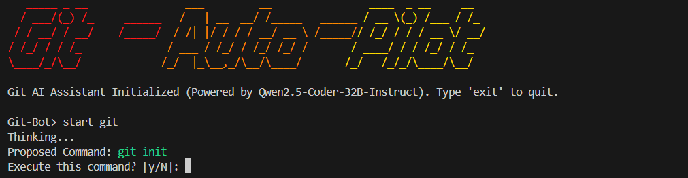

# Git-Auto-Pilot 🤖💻




---

## Overview

**Git-Auto-Pilot** is an intelligent, context-aware command-line assistant that converts natural language instructions into executable Git commands.

Powered by **Qwen 2.5 Coder 32B** through the **Hugging Face Inference API**, it provides a fast, secure, and interactive shell designed to simplify Git workflows.

Instead of memorizing hundreds of Git commands, users can communicate naturally and let the AI generate, explain, and safely execute Git operations.

---

## ✨ Key Features

* **🚀 Near-Instant Startup**
  Optimized to boot in under 2 seconds using a lightweight pure-Python memory system instead of heavy local model engines.

* **📦 Global Installation**
  Install once and use from any terminal with the `git-autopilot` command.

* **🔑 Secure Token Onboarding**
  Automatically requests your Hugging Face API token on first launch and stores it securely:

```text
~/.git_autopilot_config.json
```

* **🛡️ Human-in-the-Loop Safety Gate**
  Requires user confirmation before executing generated Git commands.

* **🧠 Global Semantic RAG Memory**
  Stores previous successful commands and retrieves relevant solutions using semantic similarity.

Memory location:

```text
~/.git_autopilot_memory.json
```

* **🔄 Auto-Correction Loop**
  Automatically captures failed command errors, analyzes them, and attempts correction up to 3 retries.

* **📦 Git LFS Support**
  Supports Git Large File Storage workflows.

---

## 🚀 Quick Start

### Clone Repository

```bash
git clone https://github.com/oculus54/Git-Auto-Pilot
cd Git-Auto-Pilot
```

Requirements:

```text
Python 3+
Git
Hugging Face API Token
```

---

## Run Assistant

Launch the interactive shell:

```bash
python hf_autoshell_v2.py
```

---

## 🔑 First-Time Token Setup

If `HF_TOKEN` is not configured, Git-Auto-Pilot will guide you through authentication:

```text
Welcome to Git Auto-Pilot!

To use the Hugging Face API, you need a free API token.

Enter your Hugging Face API Token (HF_TOKEN):
```

---

## 💡 Usage Examples

Natural language Git commands:

```text
Git-Bot> initialize a new repository

Thinking...

Proposed Command:
git init

Execute this command? [y/N]: y
```

---

```text
Git-Bot> track all large ZIP files in the repository

Thinking...

Proposed Command:
git lfs track "*.zip"

Execute this command? [y/N]: y
```

---

## 🏗️ Architecture

```text
                 User Query
                     │
                     ▼
          Natural Language Processing
                     │
                     ▼
       Sentence Transformer Embeddings
       (all-MiniLM-L6-v2)
                     │
                     ▼
          Semantic RAG Memory Search
                     │
                     ▼
              Context Injection
                     │
                     ▼
        Qwen 2.5 Coder 32B Instruct
                     │
                     ▼
          Generated Git Command
                     │
                     ▼
          Human Confirmation Gate
                     │
                     ▼
            Command Execution
                     │
                     ▼
             Memory Update
```

---

## ⚙️ How It Works

### 1. Lightweight Semantic Retrieval

The user query is converted into embeddings using:

```text
sentence-transformers/all-MiniLM-L6-v2
```

The embedding is compared against the global memory database using cosine similarity.

---

### 2. RAG Context Injection

Relevant previous commands and Git solutions are retrieved from memory and injected into the LLM context.

---

### 3. AI Command Generation

The following information is passed to:

```text
Qwen/Qwen2.5-Coder-32B-Instruct
```

Context includes:

* User request
* Operating system
* Current working directory
* Git repository information
* Retrieved memory context

---

### 4. Safe Execution

Before running any command:

```text
Proposed Command:
git <command>

Execute this command? [y/N]
```

The user always controls execution.

---

### 5. Learning Memory

Successful commands are stored locally:

```text
~/.git_autopilot_memory.json
```

Future queries become faster and more accurate.

---

## 🛠️ Tech Stack

| Technology            | Usage                 |
| --------------------- | --------------------- |
| Python                | Core CLI Engine       |
| Qwen 2.5 Coder 32B    | Code Generation LLM   |
| Hugging Face API      | Model Inference       |
| Sentence Transformers | Semantic Search       |
| Git                   | Command Execution     |
| Git LFS               | Large File Management |
| JSON                  | Local Memory Storage  |
| NPM                   | Global Installation   |

---

## Future Improvements

* Voice-controlled Git assistant
* Multi-agent Git debugging
* Repository-aware code analysis
* GitHub PR automation
* Local LLM support
* VS Code extension
* Git workflow analytics

---

## License

MIT License

---

## Author

**Debangan Makhal**
